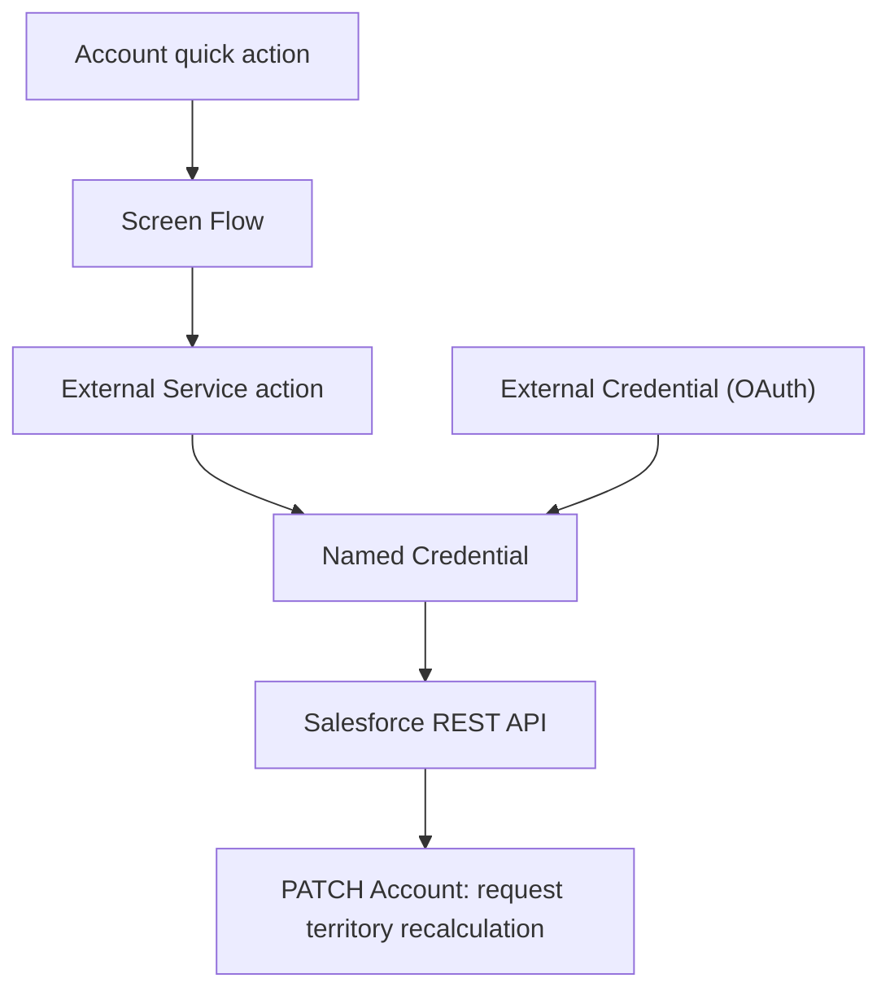

## Manual Execution of Account Territory Assignment

Salesforce territory assignment does not provide a convenient way for users to rerun assignment for an individual Account on demand; the existing process required a REST `PATCH` request. This enhancement gives users a way to trigger the assignment from Salesforce when an Account needs to be reevaluated, without preparing and sending the API request manually.

The use case is an Account whose details have changed and may now qualify for a different territory. A user initiates the action, Salesforce runs the configured territory assignment logic, and the Account’s territory assignment can be reviewed afterward.

## How it works

The **Run Territory Assignment** quick action launches a screen flow on an Account. The flow uses an External Service and Named Credential to send a Salesforce REST API request for that Account:

```http
PATCH /services/data/v66.0/sobjects/Account/{recordId}
Content-Type: application/json

{
  "Territory_Recalculation_Requested__c": true
}
```

The request sets a checkbox that signals the Account needs territory recalculation. The quick action lets a user initiate this from the Account record instead of making the `PATCH` request manually.

**Components:** Account quick action → Screen Flow → External Service → Named Credential → Salesforce REST API

## Architecture



A user clicks **Run Territory Assignment** on an Account. The screen flow calls the registered External Service, which uses the Named Credential and its OAuth configuration to make an authenticated REST `PATCH` request. That request sets `Territory_Recalculation_Requested__c` to `true`.

The automation that responds to the checkbox and performs the subsequent assignment is outside the files in this repository.
